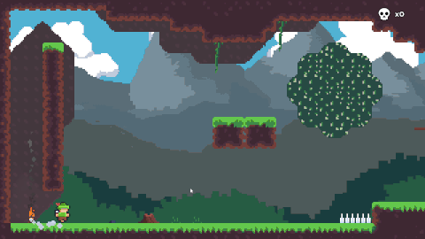

---

> Robin is a project I started 2 years ago during college. I was getting bored of doing entreprise apps and I knew I wanted to make games. I decided to start working on a game that would keep me busy during college when I didn't want to work on boring projects. 

## The concept

After playing celeste and watching a lot of talks on youtube. I decided that I wanted to have a simple core feature that could be easily expanded on. The dash in celeste was a simple mechanic that had a lot of different ideas developped around it. It kept the game simple but with a lot of complexity still. 

After trying some ideas I decided that I was going to implement an arrow that could be controlled by the player. It was a magic one. Then I sat down and wrote a bunch of ideas on paper and only kept the best one. I found a couple of good ones like: Using it as a platform, breaking stuff, activating magic circuits, deactivating traps, blocking a jump pad, etc.

## The gameplay

I know I wanted a room-based level system but I also wanted to have an open world. I took inspiration from my favorites metroid-vania games and decided that I wanted to have an universe separted in zones that the play could be backtracked. I wanted to have quests that would make the player explore differents zones of the map. The quests were only a pretex to make the player explore the world. They are not necessaries. 

## Progress

I've been working on this game on and off for a long time. Finding a balance between working on your passion project and school is hard choice. While I was working on this project, I was neglecting some valuable time that I could have spent studying. Overall, I think that working on a big project like I learned valuable knowledge that school can't teach you. Design patterns and OOP are the most useful on big projects where there is a lot of objects that interacts with each other. Games needs to have a steady framerate and is a lot more complex than a simple application. It needs to be optimized and well built to be able to get bigger without having a spaghetti mess.

## Showcase

This is an unreleased devlog that I recorded, it shows some of the features that I implemented but not all of them. I didn't show the quest system for exemple as I wanted to polish it further before showing it. I also removed some content to make the video shorter.

@[youtube](qy4KzekQZtk)
